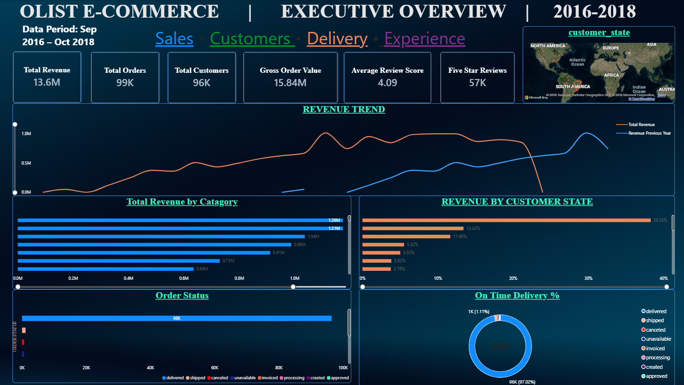
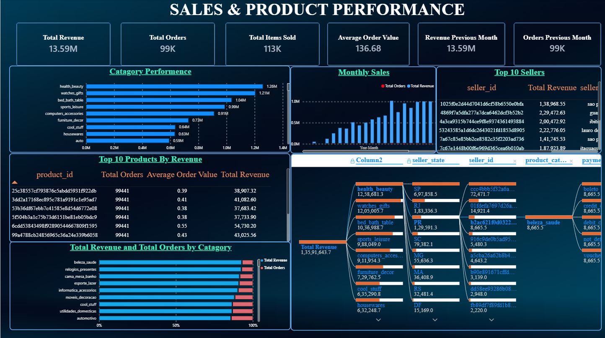
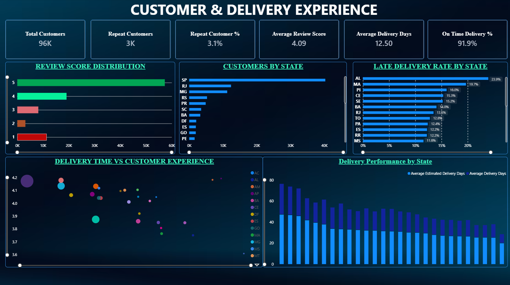

# Olist E-Commerce Sales Analytics

An end-to-end e-commerce analytics project using **Python, SQL, MySQL, Power BI, and DAX** to analyze sales performance, customer behavior, product performance, payment patterns, delivery efficiency, and customer satisfaction.

---

## 📊 Project Overview

This project analyzes the **Brazilian E-Commerce Public Dataset by Olist**, a large relational e-commerce dataset containing approximately 99,000 orders.

The project follows an end-to-end analytics workflow:

**Raw Data → Data Cleaning → Python EDA → SQL Analysis → Data Modeling → Power BI Dashboard → Business Insights**

The goal is to transform transactional data into actionable business insights that can support decisions related to sales, products, customers, logistics, and customer experience.

---

## 🎯 Business Problem

An e-commerce business needs visibility into:

- Overall sales performance
- Revenue trends
- Product and category performance
- Customer distribution
- Payment behavior
- Delivery performance
- Late deliveries
- Customer satisfaction
- Regional performance

This project addresses these questions using Python, SQL, and Power BI.

---

## 🎯 Project Objectives

- Clean and analyze multi-table transactional data
- Understand sales and revenue trends
- Identify high-performing product categories
- Analyze customer and seller activity
- Examine geographic order distribution
- Analyze payment behavior
- Measure delivery performance
- Analyze customer review scores
- Identify relationships between delivery and customer satisfaction
- Build an interactive Power BI dashboard
- Convert analytical findings into business recommendations

---

## 🛠️ Technologies Used

| Technology | Purpose |
|---|---|
| Python | Data cleaning and exploratory analysis |
| Pandas | Data manipulation |
| NumPy | Numerical operations |
| Matplotlib | Data visualization |
| Seaborn | Statistical visualization |
| MySQL | SQL business analysis |
| Power BI | Interactive dashboard |
| DAX | KPI and analytical measures |
| Git/GitHub | Version control and portfolio management |

---

## 📁 Dataset

The project uses the **Brazilian E-Commerce Public Dataset by Olist**.

The dataset contains relational information about:

- Orders
- Customers
- Order Items
- Payments
- Reviews
- Products
- Sellers
- Geolocation
- Product Category Translation

The raw CSV files are not included in this repository.

See:

`data/raw/README.md`

for dataset information and setup instructions.

---

## 🔄 Project Workflow

```text
Olist Raw Dataset
       ↓
Data Cleaning
       ↓
Data Transformation
       ↓
Exploratory Data Analysis
       ↓
SQL Business Analysis
       ↓
Power BI Data Modeling
       ↓
DAX Measures
       ↓
Interactive Dashboard
       ↓
Business Insights
```

---

## 🐍 Python Analysis

The Jupyter Notebook performs:

- Dataset inspection
- Data quality checks
- Missing-value analysis
- Duplicate checks
- Date/time transformation
- Category translation
- Sales analysis
- Monthly trend analysis
- Product/category analysis
- Customer geographic analysis
- Payment analysis
- Delivery analysis
- Review analysis

Notebook:

`notebooks/01_olist_eda.ipynb`

---

## 🗄️ SQL Analysis

The MySQL analysis contains **15 business questions**, ranging from basic aggregation to more advanced analytical queries.

Examples include:

- Total orders
- Total customers
- Total sellers
- Revenue
- Average Order Value
- Monthly revenue
- Top product categories
- Top customers
- Geographic performance
- Payment analysis
- Delivery performance
- Late delivery rate
- Seller performance
- Customer review analysis
- Advanced delivery/review analysis

SQL file:

`sql/business_questions.sql`

---

## 📊 Power BI Dashboard

The project includes an interactive Power BI dashboard designed around three major analytical areas.

### Page 1 — Executive Overview

Provides a high-level summary of:

- Revenue
- Orders
- Customers
- Average Order Value
- Review performance
- Sales trends

### Page 2 — Sales & Products

Focuses on:

- Revenue trends
- Product categories
- Top products
- Category performance
- Regional performance

### Page 3 — Customers & Delivery

Focuses on:

- Customer distribution
- Delivery performance
- Late deliveries
- Review scores
- Regional delivery performance

Power BI file:

`powerbi/Olist_Ecommerce_Analytics.pbix`

---

## 🖼️ Dashboard Preview

### Executive Overview



### Sales & Products



### Customers & Delivery



---

## 📌 Key Findings

> Replace the values below with the final values calculated from the completed analysis.

### Sales

- Total orders: **[actual value]**
- Total revenue: **R$ [actual value]**
- Average Order Value: **R$ [actual value]**
- Highest-performing period: **[actual value]**

### Products

- Top category: **[actual category]**
- Top-performing product: **[actual product]**

### Customers

- Highest-order state: **[actual state]**
- Highest-revenue state: **[actual state]**

### Delivery

- Average delivery time: **[actual value] days**
- Late delivery rate: **[actual value]%**

### Customer Satisfaction

- Average review score: **[actual value] / 5**

---

## 💡 Business Recommendations

Based on the completed analysis:

1. **Improve logistics performance** in regions with consistently high delivery times or late-delivery rates.

2. **Prioritize high-performing categories** when planning inventory and marketing activities.

3. **Monitor seller performance** to identify sellers with consistently poor delivery performance.

4. **Use customer review data** to identify areas where operational improvements may improve customer satisfaction.

5. **Monitor regional performance** to identify geographic markets with strong demand and potential growth opportunities.

---

## 📂 Project Structure

```text
olist-ecommerce-sales-analytics/
│
├── data/
│   ├── raw/
│   │   └── README.md
│   └── processed/
│       ├── README.md
│       └── analysis outputs
│
├── notebooks/
│   └── 01_olist_eda.ipynb
│
├── sql/
│   └── business_questions.sql
│
├── powerbi/
│   ├── Olist_Ecommerce_Analytics.pbix
│   └── POWER_BI_BUILD_GUIDE.md
│
├── images/
│   ├── dashboard_overview.png
│   ├── dashboard_sales.png
│   └── dashboard_customers.png
│
├── reports/
│   └── key_findings.md
│
├── README.md
├── requirements.txt
├── .gitignore
└── LICENSE
```

---

## ▶️ How to Run the Python Analysis

Clone the repository:

```bash
git clone YOUR_GITHUB_REPOSITORY_URL
```

Move into the project:

```bash
cd olist-ecommerce-sales-analytics
```

Create a virtual environment:

```bash
python -m venv .venv
```

Activate it on Windows:

```bash
.venv\Scripts\activate
```

Install dependencies:

```bash
pip install -r requirements.txt
```

Download the Olist dataset and place the required CSV files inside:

```text
data/raw/
```

Open the notebook:

```bash
jupyter notebook notebooks/01_olist_eda.ipynb
```

---

## 📊 Power BI

Open:

```text
powerbi/Olist_Ecommerce_Analytics.pbix
```

If the data source paths need to be updated, point Power BI to the local project data directory.

Additional dashboard documentation and DAX measures are available in:

```text
powerbi/POWER_BI_BUILD_GUIDE.md
```

---

## 📚 Additional Documentation

- Python EDA: `notebooks/01_olist_eda.ipynb`
- SQL analysis: `sql/business_questions.sql`
- Power BI documentation: `powerbi/POWER_BI_BUILD_GUIDE.md`
- Key findings: `reports/key_findings.md`
- Raw dataset instructions: `data/raw/README.md`
- Processed data information: `data/processed/README.md`

---

## 👤 Author

**Sayan Panda**

BCA Graduate | Data Analytics | Python | SQL | Power BI

LinkedIn: https://www.linkedin.com/in/sayanpanda3004

---

## 📌 Disclaimer

This project is intended for educational and portfolio purposes.

The dataset belongs to its original provider and is used according to its applicable dataset terms and license.
